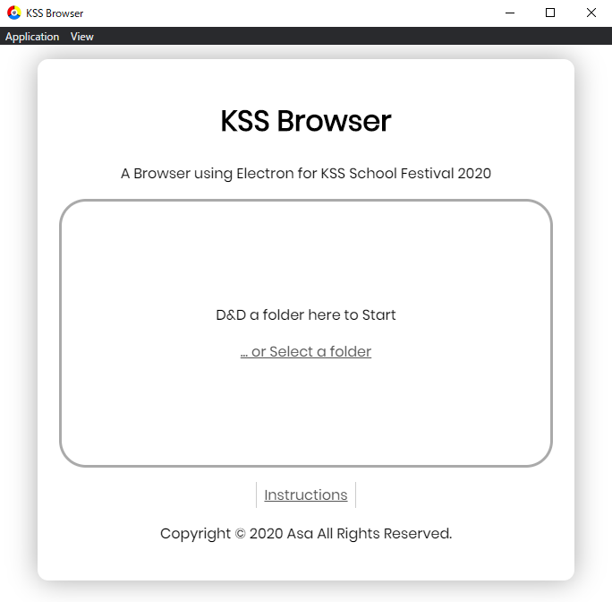

# KSS Browser

     

## What's this?

A Browser using Electron for KSS School Festival 2020. 
For Windows only.

## How to Compile & Use

1. Clone this repo 
  `git clone https://github.com/a01sa01to/ElectronBrowser.git`
2. Install dependencies 
  `npm i`
3. Compile 
  `npm run build` or `npm run testBuild` 

  A difference is whether the installer exists. 
  `build` to create installer at `dist/kss-browser Setup ${version}.exe`. 
  No matter which you choose, `src/` will be compiled to `dist/win-unpacked/kss-browser.exe`

## Release

 

> Version 1.0 & 1.1 Released on 2020.01.11 
> Version 1.2 Released on 2020.01.22

## Author

 
[Asa (a.k.a Otsun)（@a01sa01to）](https://twitter.com/a01sa01to) 
[Send Message to Author](https://twitter.com/messages/compose?recipient_id=4273512934)

## License

This repo is under the MIT License. 
See [LICENSE](https://github.com/a01sa01to/ElectronBrowser/blob/master/LICENSE) File.

## Screenshot

